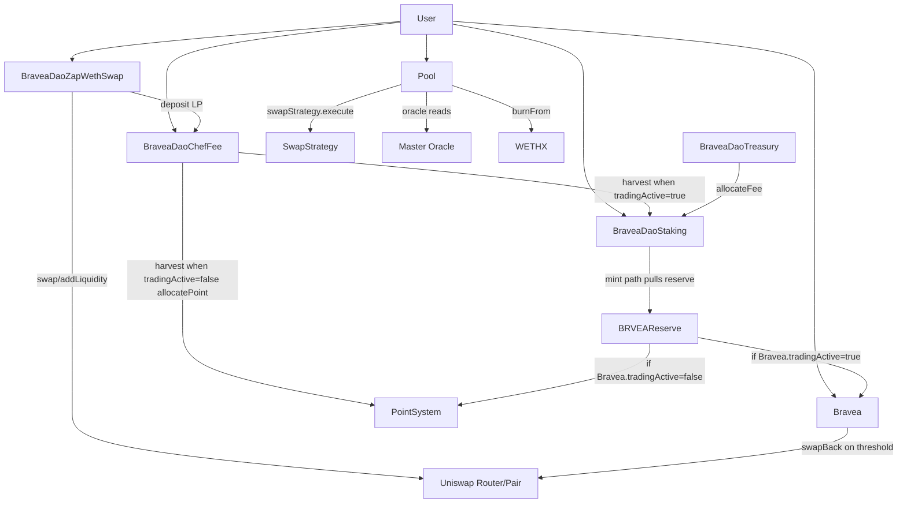
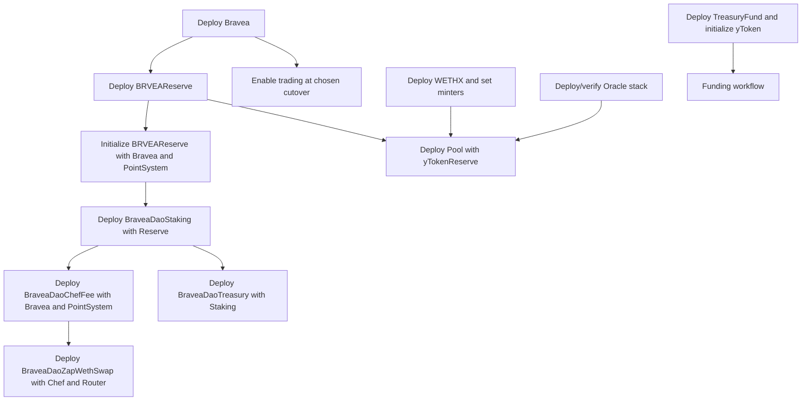

# Bravea Contract Flow Map (Contract-Only)

Status: Drafted from recovered Solidity sources and current Base Sepolia app config
Network focus: Base Sepolia (chainId 84532)

## 1. Scope

This document maps contract-to-contract and actor-to-contract flows only.

Included contracts:
- recovered-contracts/Bravea.sol
- recovered-contracts/BraveaDaoChefFee.sol
- recovered-contracts/BraveaDaoStaking.sol
- recovered-contracts/BraveaDaoTreasury.sol
- recovered-contracts/BraveaDaoZapWethSwap.sol
- recovered-contracts/BRAVEATreasuryFund.sol
- recovered-contracts/BRVEAReserve.sol
- recovered-contracts/Pool.sol
- recovered-contracts/WETHX.sol

## 2. Address Tracks

### 2.1 Base Sepolia Baseline (currently active in frontend config)
Source: src/Config/index.js

- PTN token: 0x5bfb9993934052b62F2Dd84255998577Ef5E602C
- WETH token: 0x4200000000000000000000000000000000000006
- Uniswap router: 0x1689E7B1F10000AE47eBfE339a4f69dECd19F602
- WETHX token: 0x4348d4aFEDdD8d34C67873BeFdA748Ee798f723C
- PotionDaoChef: 0xAAf5Db6636D5d60B8c9af2C79B236852aa19239A
- PTN reserve: 0x8190baa290727283CE55e561499A6fAE51e9c79c
- PotionDaoStaking: 0x93ecC3d388A3a86D932de8cae9f386f73Cc53C65
- PotionDaoTreasury: 0x1Abe9dD204E1D0c42b4335Ac8812372dfccb4970
- PTN Treasury Fund: 0x55037bDA630d8d376487EF80dD2E9c01b5Ed012b
- PotionDaoZap: 0xF7a7010347a420b7Ca82eE90f64f16803FC8176b
- WETHX/PTN Pool: 0xf1348F07A34Bb2451F6fEA4Bcf3292416F5a6EC5
- WETH/PTN Oracle: 0x691Cbd6475dbBc75980C706a5506ac1Cf737212d
- WETHX/WETH Oracle: 0x1ecB17B046e7B5845c4E7A754c666cf121004c9B
- Master Oracle: 0x8De288D8bFd2928DF3e480f7A3Cf03746f06AC2b

### 2.2 Fresh Redeploy Track (future migration)
Use placeholders and replace at deploy time:
- PTN_TOKEN_ADDRESS=<new>
- WETHX_TOKEN_ADDRESS=<new>
- PTN_RESERVE_ADDRESS=<new>
- STAKING_ADDRESS=<new>
- CHEF_ADDRESS=<new>
- TREASURY_ADDRESS=<new>
- TREASURY_FUND_ADDRESS=<new>
- POOL_ADDRESS=<new>
- ZAP_ADDRESS=<new>
- ORACLE_* addresses=<new>

Note:
- src/Config/addresses.json contains old Shield/BSC-era values and should be treated as historical unless explicitly reactivated.

## 3. Global Call Flow Map (who calls who and when)



## 4. Contract Trigger Matrix

### 4.1 Bravea (token + fee swap)
Key source anchors:
- constructor: recovered-contracts/Bravea.sol:391
- trading enable: recovered-contracts/Bravea.sol:436

Trigger table:
- Owner calls enableTrading
  - Sets tradingActive=true, swapEnabled=true, stores tradingActiveBlock
  - Transition point from pre-trading to active-trading behavior in dependent contracts
- User buys/sells via AMM pair
  - Fee accumulation and swapBack path executes when internal threshold is met
  - External interactions: router swaps and liquidity operations

### 4.2 BRVEAReserve (critical timing contract)
Key source anchors:
- initialize: recovered-contracts/BRVEAReserve.sol:618
- setRewarder: recovered-contracts/BRVEAReserve.sol:628
- setPool: recovered-contracts/BRVEAReserve.sol:634
- transfer gate: recovered-contracts/BRVEAReserve.sol:644

Reserve timing rules:
- BRVEAReserve.transfer(to, amount) is callable only by:
  - rewarder (single address), or
  - addresses in allowedPools
- On call:
  - If Bravea.tradingActive() is true -> transfer BRVEA tokens
  - Else -> allocate points via PointSystem

This is the exact place where pre-trading vs post-trading reward mode changes.

### 4.3 BraveaDaoStaking (multi-reward + minted-lock model)
Key source anchors:
- constructor: recovered-contracts/BraveaDaoStaking.sol:986
- addReward: recovered-contracts/BraveaDaoStaking.sol:1010
- stake: recovered-contracts/BraveaDaoStaking.sol:1168
- mint: recovered-contracts/BraveaDaoStaking.sol:1194
- withdraw: recovered-contracts/BraveaDaoStaking.sol:1216
- notifyRewardAmount: recovered-contracts/BraveaDaoStaking.sol:1335

Trigger table:
- constructor(_stakingToken, _stakingTokenReserve, _minters, _teamWallet, initialOwner)
  - Calls stakingTokenReserve.setRewarder(address(this)) immediately
- minter calls mint(user, amount)
  - Adds earned balance and lock schedule
  - Calls stakingTokenReserve.transfer(address(this), amount)
  - Reserve decides token transfer vs point allocation based on Bravea trading state
- approved distributor calls notifyRewardAmount(token, reward)
  - Transfers reward from distributor
  - Splits team reward and staker reward
  - Updates reward rate window

### 4.4 BraveaDaoChefFee (farm)
Key source anchors:
- constructor: recovered-contracts/BraveaDaoChefFee.sol:781
- deposit: recovered-contracts/BraveaDaoChefFee.sol:859
- withdraw: recovered-contracts/BraveaDaoChefFee.sol:887
- harvest: recovered-contracts/BraveaDaoChefFee.sol:920
- harvestAllRewards: recovered-contracts/BraveaDaoChefFee.sol:1021

Trigger table:
- user deposit(pid, amount, to)
  - updates pool
  - transfers LP in
  - may call rewarder hook
- user withdraw(pid, amount, to)
  - if unlockTime not reached: penalty fee sent to feeWallet
  - LP returned after penalty
- user harvest(pid, to)
  - if bravea.tradingActive(): rewardMinter.mint()
  - else: pointsystem.allocatePoint()
  - optional NFT boost follows same branch

### 4.5 BraveaDaoTreasury (fee allocator)
Key source anchors:
- constructor: recovered-contracts/BraveaDaoTreasury.sol:541
- requestFund: recovered-contracts/BraveaDaoTreasury.sol:561
- allocateFee: recovered-contracts/BraveaDaoTreasury.sol:597

Trigger table:
- owner allocateFee(token, amount)
  - approves staking
  - calls staking.notifyRewardAmount(token, amount)
- whitelisted strategy requestFund(token, amount)
  - treasury grants allowance to strategy

### 4.6 BraveaDaoZapWethSwap (one-click LP + farm)
Key source anchors:
- constructor: recovered-contracts/BraveaDaoZapWethSwap.sol:933
- zap: recovered-contracts/BraveaDaoZapWethSwap.sol:949

Trigger table:
- user zap(zapId, minLiquidity, ethIn, transferResidual)
  - transfer token0 from user
  - swap part to pair token
  - addLiquidity via router
  - deposit LP into Chef for user
  - optionally return residual dust

### 4.7 Pool (mint/redeem engine)
Key source anchors:
- constructor: recovered-contracts/Pool.sol:1358
- calcMint: recovered-contracts/Pool.sol:1410
- calcRedeem: recovered-contracts/Pool.sol:1437
- refreshCollateralRatio: recovered-contracts/Pool.sol:1483
- mint: recovered-contracts/Pool.sol:1513
- redeem: recovered-contracts/Pool.sol:1538
- collect: recovered-contracts/Pool.sol:1578

Trigger table:
- user mint(minXOut, ethIn)
  - reads oracle prices
  - may swap collateral portion through swapStrategy
  - books unclaimed xToken, fee to treasury path
- user redeem(xIn, minYOut, minEthOut)
  - checks collateral sufficiency
  - price fluctuation checks
  - burns xToken, books claimables, fee to treasury path
- user collect()
  - enforces minimum delay (lastAction < current block)
  - transfers booked balances out
- any caller refreshCollateralRatio()
  - after cooldown, adjusts CR based on xToken TWAP band

### 4.8 WETHX
Key source anchors:
- setMinter: recovered-contracts/WETHX.sol:661
- mint: recovered-contracts/WETHX.sol:673
- constructor: recovered-contracts/WETHX.sol:689
- OpenTrade: recovered-contracts/WETHX.sol:695

Trigger table:
- owner setMinter(address)
- allowed minter mint(address, amount)
- operator OpenTrade() to remove transfer gate

### 4.9 BRAVEATreasuryFund
Key source anchors:
- Fund.initialize(yToken): recovered-contracts/BRAVEATreasuryFund.sol:603
- Fund.transfer(receiver, amount): recovered-contracts/BRAVEATreasuryFund.sol:638
- constants: recovered-contracts/BRAVEATreasuryFund.sol:654

Trigger table:
- owner transfers only up to claimable() amount from vesting schedule

## 5. Deployment Dependencies

### 5.1 Prerequisites (before first deployment tx)
- Deployer wallet funded on Base Sepolia
- Canonical WETH confirmed for Base
- Router address confirmed for target DEX
- PointSystem contract ready (required by BRVEAReserve initialize and Chef constructor)
- Oracle and swap strategy stack designed for Pool
- Ownership target decided (EOA vs multisig)

### 5.2 Dependency DAG



## 6. Deployment Process

### 6.1 Architecture-level ordered steps

1. Deploy tokens and reserves
- Deploy Bravea
- Deploy WETHX (if fresh track)
- Deploy BRVEAReserve(initialOwner)
- Call BRVEAReserve.initialize(bravea, pointSystem)

2. Deploy staking and farming
- Deploy BraveaDaoStaking(stakingToken, reserve, minters, teamWallet, initialOwner)
- Deploy BraveaDaoChefFee(initialOwner, feeWallet, bravea, pointSystem)
- Deploy BraveaDaoTreasury(staking, initialOwner)

3. Deploy pool and zap
- Deploy Pool(xToken, yToken, yTokenReserve, initialOwner)
- Deploy BraveaDaoZapWethSwap(chef, uniRouter, initialOwner)

4. Post-deploy role and pool setup
- Reserve: setPool(pool) and any other allowed pools
- Staking: addReward(token, distributor), approveRewardDistributor(token, distributor, true)
- WETHX/XToken: setMinter(pool or authorized minters)
- Chef: add pools and reward params

5. Trading cutover
- Call Bravea.enableTrading() when pre-trading point phase is complete

### 6.2 Command-level runbook templates

Foundry-style template:
```bash
# env
export RPC_URL=https://sepolia.base.org
export PRIVATE_KEY=<deployer_key>
export ETHERSCAN_API_KEY=<basescan_key>

# deploy examples (replace script/contract paths)
forge script script/DeployBravea.s.sol:DeployBravea --rpc-url $RPC_URL --broadcast --verify
forge script script/DeployReserve.s.sol:DeployReserve --rpc-url $RPC_URL --broadcast --verify
forge script script/DeployStaking.s.sol:DeployStaking --rpc-url $RPC_URL --broadcast --verify

# post-deploy calls examples
cast send <RESERVE> "initialize(address,address)" <BRAVEA> <POINT_SYSTEM> --rpc-url $RPC_URL --private-key $PRIVATE_KEY
cast send <RESERVE> "setPool(address)" <POOL> --rpc-url $RPC_URL --private-key $PRIVATE_KEY
cast send <STAKING> "addReward(address,address)" <REWARD_TOKEN> <DISTRIBUTOR> --rpc-url $RPC_URL --private-key $PRIVATE_KEY
cast send <BRAVEA> "enableTrading()" --rpc-url $RPC_URL --private-key $PRIVATE_KEY
```

Hardhat-style template:
```bash
# env
export RPC_URL=https://sepolia.base.org
export PRIVATE_KEY=<deployer_key>

# deploy and setup placeholders
npx hardhat run scripts/deploy-core.ts --network baseSepolia
npx hardhat run scripts/setup-roles.ts --network baseSepolia
npx hardhat run scripts/setup-pools.ts --network baseSepolia
npx hardhat run scripts/enable-trading.ts --network baseSepolia
```

## 7. Post-Deployment Process

### 7.1 Immediate post-deploy checklist
- Verify ownership of each contract is expected owner/multisig
- Verify minter and distributor permissions
- Verify reserve rewarder and allowedPools set
- Verify Chef poolLength > 0 and poolInfo readable
- Verify Pool info() and oracle reads return sane values
- Verify tradingActive is false before launch, then true only at cutover

### 7.2 Runtime operational cadence
- Reward funding: treasury allocateFee -> staking notifyRewardAmount
- Harvest cadence: user-driven via Chef harvest or harvestAllRewards
- CR updates: periodic refreshCollateralRatio calls respecting cooldown
- Mint/redeem/collect: user-driven on Pool

### 7.3 Post-launch validation gates
Use TESTING_CHECKLIST_BASE_SEPOLIA.md gate structure:
- Gate A (startup/network)
- Gate B (read validity)
- Gate C (critical writes)
- Gate D (negative tests)
- Gate E (persistence)

## 8. Risks and Ambiguities to Resolve

1. Vesting mismatch
- BRAVEATreasuryFund constant says 1 day while comment says 3 months
- Source: recovered-contracts/BRAVEATreasuryFund.sol:654

2. Historical address drift
- Active baseline is src/Config/index.js
- src/Config/addresses.json holds old Shield naming and old addresses

3. PointSystem dependency
- Pre-trading behavior depends on PointSystem implementation not included in recovered folder

4. Oracle confidence
- Pool safety heavily depends on oracle freshness and correctness

## 9. Quick Operator Sequence (minimum safe path)

1. Confirm config source-of-truth in src/Config/index.js
2. Verify all deployed addresses on Base Sepolia explorer
3. Confirm Reserve initialized and connected to Bravea + PointSystem
4. Confirm Staking reward token/distributor setup
5. Confirm Chef pools configured and readable
6. Run small-value write tests for stake/farm/mint/redeem/collect
7. Enable trading only after pre-trading checks pass
8. Re-run post-launch smoke and persistence checks
