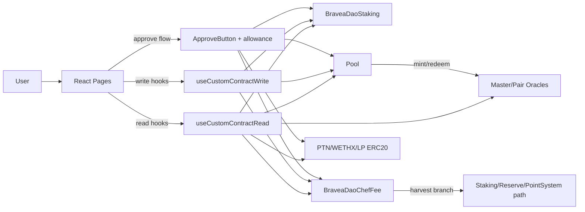
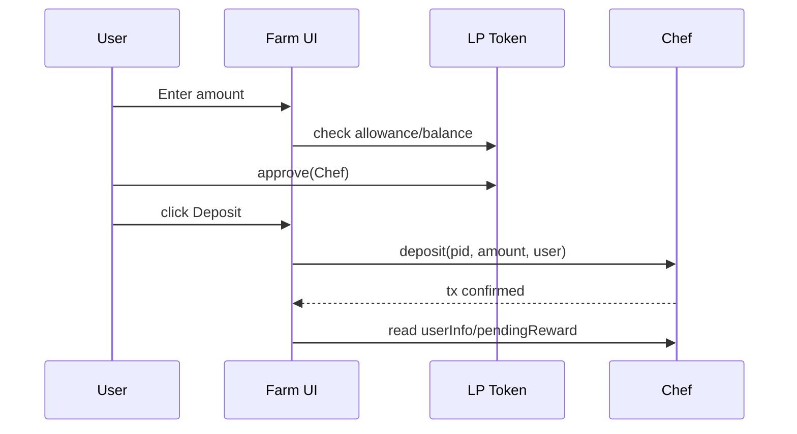
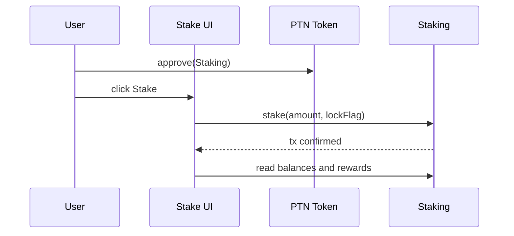
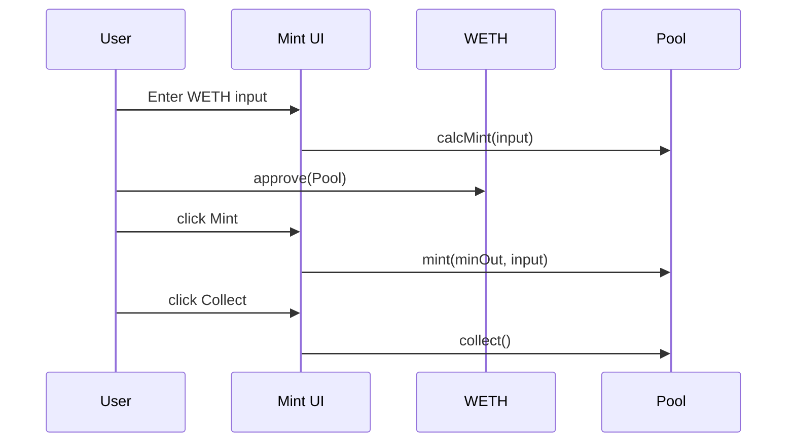
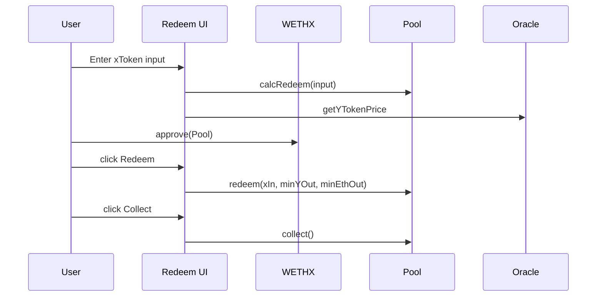

# Bravea System Flow Map (Contracts + Frontend)

Status: Drafted from frontend page code, hooks, and recovered contracts
Network focus: Base Sepolia (chainId 84532)

## 1. Scope

This document maps end-to-end system behavior:
- UI route and component actions
- Contract reads/writes triggered by UI
- Approval dependencies
- Runtime state transitions
- Deployment and post-deployment processes

Contract-only deep logic is covered in CONTRACT_FLOW_MAP.md. This document references that logic and adds frontend orchestration.

## 2. Network and Address Baseline

Primary source of truth:
- src/Config/index.js (active Base Sepolia block)

Historical/conflicting source:
- src/Config/addresses.json (old Shield naming and addresses)

Recommendation:
- Treat src/Config/index.js as active runtime config.
- Keep src/Config/addresses.json as archival unless intentionally reactivated.

## 3. Frontend Architecture Entry Points

Key shared abstractions:
- Reads: src/Hooks/useCustomContractRead.js
- Writes: src/Hooks/useCustomContractWrite.js
- Allowance checks: src/Hooks/useCheckAllowance.js
- Approvals: src/common/ApproveButton.js

Primary route components used in flow mapping:
- src/Pages/Home/Home.jsx
- src/Pages/Dashboard/Dashboard.jsx
- src/Pages/Tools/Tool.jsx
- src/Pages/Tools/Accordion.jsx
- src/Pages/Stake/Stake.jsx
- src/Pages/Stake-Withdraw/Stake_withdraw.jsx
- src/Pages/Lock/Lock.jsx
- src/Pages/Lock-Withdraw/Lock_withdraw.jsx
- src/Pages/Mint/Mint.jsx
- src/Pages/Redeem/Redeem.jsx

## 4. End-to-End System Map



## 5. Route-by-Route Call Matrix

### 5.1 Home route
Source: src/Pages/Home/Home.jsx

Reads:
- Staking rewardData(token), rewardsDuration, lockedSupply
- Master Oracle getYTokenPrice, getXTokenPrice, getXTokenTWAP
- WETHX/WETH oracle blockTimestampLast
- Pool info, lastRefreshCrTimestamp
- Chef poolLength, poolInfo, rewardPerSecond, totalAllocPoint
- LP pair reserves and LP totals for APR/TVL calculations

Writes:
- None direct in this page

Purpose:
- Dashboard metrics, APR display, pool summaries, external links

### 5.2 Farm route (Tool + Accordion)
Sources:
- src/Pages/Tools/Tool.jsx
- src/Pages/Tools/Accordion.jsx

Reads:
- Chef poolLength, lpToken(pid), userInfo(pid,user), pendingReward, poolInfo, rewardPerSecond
- Zap zaps(pid) metadata
- LP and token balances

Writes:
- Tool page: Chef harvestAllRewards(address)
- Accordion per pool:
  - Chef deposit(pid, amount, to)
  - Chef withdraw(pid, amount, to)
  - Chef harvest(pid, to)
  - Chef emergencyWithdraw(pid, to)

Approvals:
- LP token approve to Chef before deposit

When these writes trigger contract cross-calls:
- Chef harvest path follows tradingActive gate:
  - trading active -> rewardMinter.mint
  - trading inactive -> pointsystem.allocatePoint

### 5.3 Stake route
Source: src/Pages/Stake/Stake.jsx

Reads:
- Staking lockDuration, rewardData, rewardsDuration
- Staking lockedSupply, totalSupply
- User views: lockedBalances, unlockedBalance, earnedBalances, withdrawableBalance, claimableRewards

Writes:
- Staking stake(amount, false)
- Staking stake(amount, true)
- Staking withdraw(amount)
- Staking getReward()
- Staking withdrawExpiredLocks()
- Staking emergencyWithdraw()

Approvals:
- PTN approve to Staking

### 5.4 Stake Withdraw route
Source: src/Pages/Stake-Withdraw/Stake_withdraw.jsx

Reads/Writes:
- Same family as Stake route, focused on withdrawal and reward claiming paths

Approvals:
- PTN approve to Staking where required

### 5.5 Lock route
Source: src/Pages/Lock/Lock.jsx

Reads:
- Same staking reads as Stake route

Writes:
- stake(amount, true)
- plus reward and withdrawal methods depending on UI section

Approvals:
- PTN approve to Staking

### 5.6 Lock Withdraw route
Source: src/Pages/Lock-Withdraw/Lock_withdraw.jsx

Reads/Writes:
- Same staking methods, focused on lock-specific withdrawal states

### 5.7 Mint route
Source: src/Pages/Mint/Mint.jsx

Reads:
- Pool calcMint(ethIn)
- Pool info()
- Pool xToken()
- Pool userInfo(address)
- wallet/token balances

Writes:
- Pool mint(minXTokenOut, ethIn)
- Pool collect()

Approvals:
- WETH approve to Pool before mint

System trigger notes:
- Mint is gated in UI by amount > 0, sufficient balance, mint not paused, and allowance status.

### 5.8 Redeem route
Source: src/Pages/Redeem/Redeem.jsx

Reads:
- Pool calcRedeem(xIn)
- Pool info, xToken, yToken, userInfo
- Master Oracle getYTokenPrice

Writes:
- Pool redeem(xTokenIn, minYOut, minEthOut)
- Pool collect()

Approvals:
- xToken (WETHX) approve to Pool before redeem

System trigger notes:
- Redeem is gated in UI by amount > 0, sufficient xToken balance, redemption not paused, and allowance status.

## 6. User Journey Sequences

### 6.1 Farm Deposit Journey



### 6.2 Stake Journey



### 6.3 Mint Journey



### 6.4 Redeem Journey



## 7. Deployment Process (System View)

This section intentionally includes both architecture-level and command-level format.

### 7.1 Architecture-level process

1. Contract deployment and initialization
- Deploy core contracts in dependency order from CONTRACT_FLOW_MAP.md
- Initialize BRVEAReserve and staking reward/distributor roles
- Configure Chef pools and emission parameters
- Configure Pool dependencies (oracle/swap strategy/minter integrations)

2. Frontend environment wiring
- Confirm chain/rpc/explorer links in src/Config/index.js
- Confirm all deployed contract addresses are set
- Confirm no accidental fallback to old addresses

3. Cutover and validation
- Execute smoke reads on all pages
- Execute one small write flow for each critical action type
- Enable trading when pre-trading checks pass

### 7.2 Command-level runbook templates

Contract deploy template (choose one toolchain):
```bash
# Foundry-style
forge script script/DeployAll.s.sol:DeployAll --rpc-url https://sepolia.base.org --broadcast --verify

# Hardhat-style
npx hardhat run scripts/deploy-all.ts --network baseSepolia
```

Post-deploy setup template:
```bash
# Reserve init
cast send <RESERVE> "initialize(address,address)" <BRAVEA> <POINTSYSTEM> --rpc-url https://sepolia.base.org --private-key <key>

# Reward token setup
cast send <STAKING> "addReward(address,address)" <TOKEN> <DISTRIBUTOR> --rpc-url https://sepolia.base.org --private-key <key>
cast send <STAKING> "approveRewardDistributor(address,address,bool)" <TOKEN> <DISTRIBUTOR> true --rpc-url https://sepolia.base.org --private-key <key>

# Trading cutover
cast send <BRAVEA> "enableTrading()" --rpc-url https://sepolia.base.org --private-key <key>
```

Frontend verification template:
```bash
npm install
npm start
```

Then validate Gate A-E in TESTING_CHECKLIST_BASE_SEPOLIA.md.

## 8. Post-Deployment Process

### 8.1 Contract-side checks
- Ownership and privileged roles are correct
- Reserve rewarder and pool whitelists configured
- Chef poolLength and poolInfo readable
- Staking reward tokens/distributors set
- Pool info/oracle data not stale

### 8.2 Frontend-side checks
- Wallet on Base Sepolia
- All main routes load without crash
- Read metrics show no NaN
- Approve -> write -> post-refresh state transitions verified

### 8.3 Critical write confirmations
- Farm deposit and withdraw
- Stake and withdraw
- Lock and withdrawExpiredLocks
- Claim rewards and harvestAllRewards
- Mint and collect
- Redeem and collect

### 8.4 Evidence capture
- Tx hash for each write path
- Screenshot per successful flow
- Failure-case evidence for negative tests

## 9. Known Gaps and Risks

1. Oracle addresses in active config are explicitly marked as potentially old; verify on Base Sepolia before production confidence.
2. Frontend contains legacy fallback constants and comments; avoid mixing them with active values.
3. Zap write behavior in src/Pages/Tools/ZapModal.jsx appears partially commented, so farm flows should rely on current live components.
4. Vesting duration/comment mismatch in BRAVEATreasuryFund should be treated as a design clarification item.

## 10. Fresh Redeploy Parameter Checklist

Before running a fresh deployment, prepare:
- initialOwner address
- feeWallet and teamWalletAddress
- pointSystem address
- minters array for staking
- staking token and reserve addresses
- Chef initial pool definitions and alloc points
- Pool xToken/yToken/yTokenReserve plus oracle/swap strategy links
- post-deploy role grants and reward distributor list

After deployment, update src/Config/index.js and rerun full Base Sepolia test gates.
